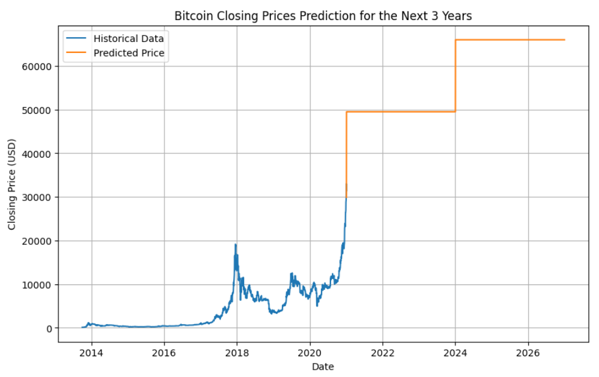

# Bitcoin Price Prediction Model

## Introduction
In this report, we present a Bitcoin price prediction model using recurrent neural networks (RNNs), specifically the Long Short-Term Memory (LSTM) algorithm. The main goal is to predict the closing price of Bitcoin based on historical data, in order to identify patterns and trends in the cryptocurrency market.

## Problem Description
The cryptocurrency market, particularly the price of Bitcoin, is highly volatile and subject to abrupt fluctuations over short periods of time. Predicting these price movements accurately is a significant challenge for investors and traders in this market. Our objective is to develop a model that can capture these fluctuations and provide useful predictions for decision-making.

## Data Used
We used a dataset containing historical daily closing prices of Bitcoin, as well as other related metrics such as trading volume, market capitalization, and market sentiment data. For this report, we focused exclusively on the daily closing price of Bitcoin, which is the target variable of our model.

## Modeling Process
1. **Data Preprocessing**: We started by loading the historical data into a Pandas DataFrame and performed initial exploratory analysis to understand the distribution and trends in the data. We then normalized the data to be in the range of 0 to 1, which facilitates model training.

2. **Data Splitting**: We split the data into training and testing sets, using 80% of the data for training and the remaining 20% for testing.

3. **Modeling with LSTM**: We used an LSTM model to capture the sequential structure in the time series data. The model consists of an LSTM layer with 50 memory units and a dense layer for output. We compiled the model using the mean squared error (MSE) loss function and the Adam optimizer.

4. **Model Training**: We trained the model using the training data and validated its performance using the testing data. We performed multiple epochs of training and adjusted hyperparameters to optimize the model's performance.

## Results
After training the model, we evaluated its performance using the testing data and observed the mean squared error (MSE) as an evaluation metric. We also made predictions on future data to assess the model's ability to capture Bitcoin price fluctuations.

## Conclusions
Our LSTM model shows the ability to capture general trends in the price of Bitcoin, but may struggle to accurately predict sharp movements and extreme market fluctuations. It is important to note that the cryptocurrency market is highly volatile and subject to multiple factors that may influence prices. Additional techniques and more advanced models could be explored to improve prediction accuracy in future work.

---

---

To reproduce the results and run the model, please refer to the code provided in the repository. Make sure to install the necessary dependencies.
